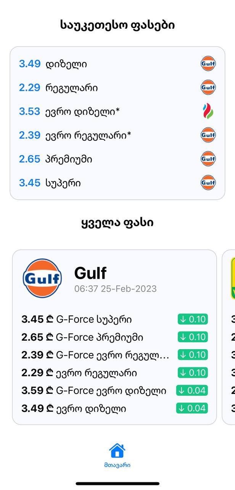
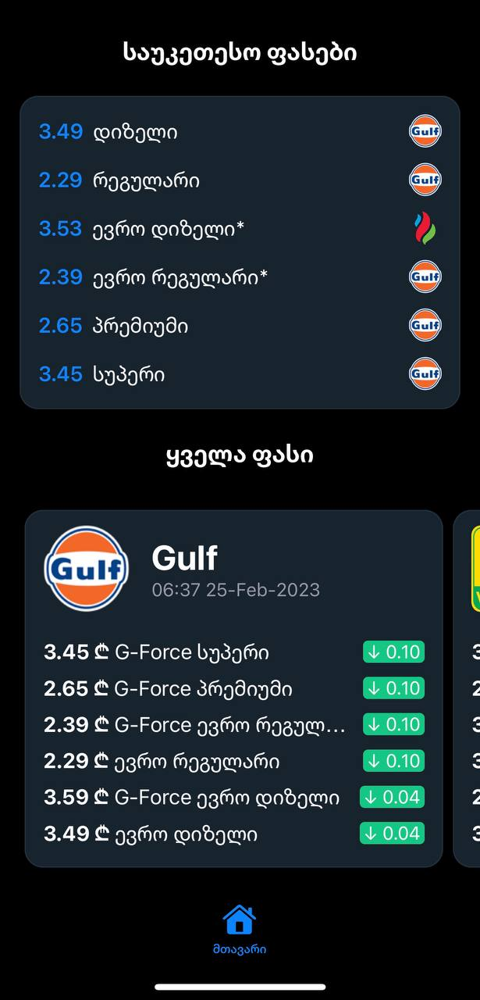

<div align="center">
    
    <h1>Fuel Prices IOS</h1>
    <small> <a href="https://github.com/NickNaskida/FuelPrices">Web Client</a> </small>
</div>

### 🗃 About Project

FuelPrices is an Open Source project that allows people to monitor Georgia's fuel prices. With this web and ios app people can
monitor, compare fuel prices, and use API to access current prices

<p>


</p>

### API Base URL & Docs

You can change it in `Config.swift`

```http
  https://sawvavi.tk/api/
```

### 👨🏼‍🔬 Contributing

Contributions are what make the open source community such an amazing place to learn, inspire, and create. Any
contributions you make are greatly appreciated.

If you have a suggestion that would make this better, please fork the repo and create a pull request. You can also
simply open an issue with the tag "enhancement". Don't forget to give the project a star! Thanks in advance!

In general, we follow the "fork-and-pull" Git workflow

#### How to submit a Pull Request

- Search our repository for open or closed Pull Requests that relate to your submission. You don't want to duplicate
  effort.
- Fork the project on GitHub.
- Create your feature branch
- Do your work. Read the docs to this project.
- Commit your changes (Please use semantic commit
  messages: [Semantic commit messages](https://gist.github.com/joshbuchea/6f47e86d2510bce28f8e7f42ae84c716))
- Push to the branch
- Open a Pull Request and wait for feedback.

🎉 Thank you for your contribution!

### License

This project is licensed under the [CC0 1.0 Universal](https://creativecommons.org/publicdomain/zero/1.0/) license.

